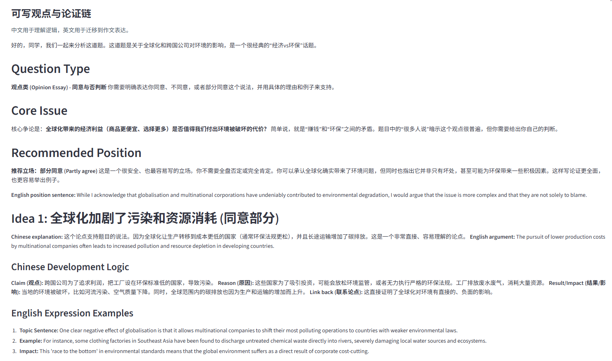
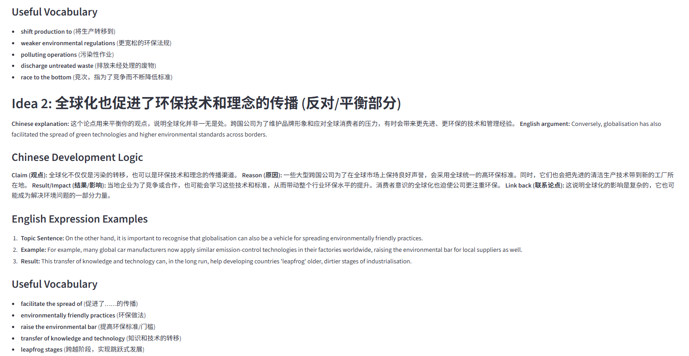
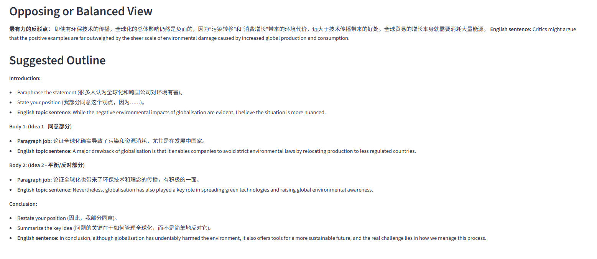
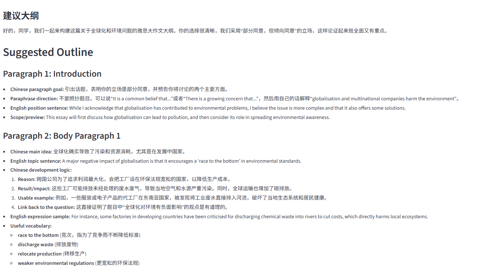
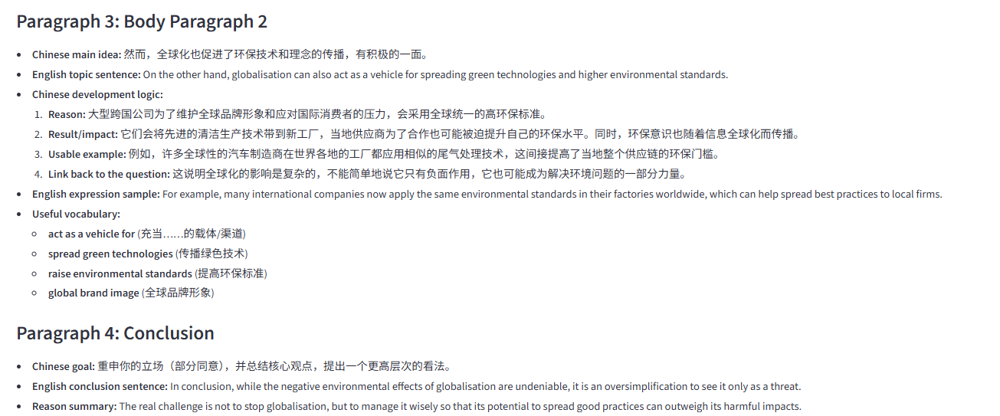

# IELTS Task 2 Idea Trainer

An IELTS Writing Task 2 learning agent for students who understand the question
but often get stuck on ideas, argument development, examples, and paragraph
logic.

This product is not a generic essay chatbot and not a ghostwriter. It is designed
to help learners understand how to think, develop arguments, organize a
four-paragraph essay, and improve Task Response and Coherence over time.

## Feature Preview

### Question Analysis: Type, Topic, and Core Issue


### Opinions: Writable Ideas and Argument Chains







### Outline Builder: Suggested Four-Paragraph Plan





### Writing Tips: Paragraph-Level Reminders


## Product Focus

Core user: IELTS learners targeting Band 6.5-7 who often struggle with Task 2
idea generation and coherent development.

The agent helps learners move through this loop:

1. Understand the question.
2. Identify the question type and core issue.
3. Generate writable positions and ideas.
4. Explain argument logic in Chinese.
5. Provide English topic sentences and useful expressions.
6. Build a four-paragraph outline.
7. Let the learner write or compare with a sample essay.
8. Evaluate the learner's essay with an actual IELTS band estimate.

## Key Features

- Question analysis: detects IELTS Task 2 question type, topic, and core issue.
- Idea generation: produces Chinese reasoning plus English argument expression.
- Dynamic writing path UI: adapts stance choices to opinion, discussion,
  advantages/disadvantages, problem-solution, and two-part questions.
- Outline builder: turns selected ideas into a four-paragraph writing plan.
- Sample essay generation: provides a study reference, not a forced answer.
- Essay evaluation: checks idea quality and estimates the actual band from 0-9.
- RAG reference library: retrieves topic ideas, vocabulary, structures, rubrics,
  and sample paragraph logic.
- Harness: internal quality-control runner for model, prompt, and RAG changes.

## Architecture

```text
IELTS Task 2 question
  -> Question analysis
  -> RAG reference retrieval
  -> Idea and argument generation
  -> User selects or edits writing path
  -> Outline builder
  -> Optional sample essay
  -> Learner essay evaluation
  -> History and future practice
```

## RAG Reference Library

RAG is the internal writing reference library. It is not exposed to learners as a
technical feature name.

Collections:

- `topics`: high-frequency topic ideas and examples
- `vocabulary`: Band 6.5-7+ collocations and phrase bank
- `structures`: essay structures for different Task 2 question types
- `rubrics`: IELTS Writing Task 2 assessment criteria
- `sample_essays`: high-score paragraph and essay references

Source files:

```text
data/knowledge_base/topics/
data/knowledge_base/vocabulary/collocations.json
data/knowledge_base/structures/essay_structures.json
data/knowledge_base/rubrics/
data/knowledge_base/sample_essays/band7_samples.json
```

Build or inspect the vector store:

```powershell
.\.venv\Scripts\python.exe -m src.rag.retriever --build
.\.venv\Scripts\python.exe -m src.rag.retriever --count
```

## Harness

Harness is an internal quality-control system. It is used to verify whether a
change improves or damages the agent's output quality.

It can test:

- OpenAI vs DeepSeek
- Prompt version A vs prompt version B
- RAG before vs after adding new materials
- Whether a new change increases off-topic answers, generic ideas, or missing
  outline sections

Quality layers:

1. Rule checks: required sections, stance, examples, outline, and relevance.
2. LLM-as-judge: Task Response, Coherence and Cohesion, Lexical Resource, and
   Grammatical Range and Accuracy.
3. Human review: IELTS realism, teachability, argument depth, and risk.

Run a small harness check:

```powershell
.\.venv\Scripts\python.exe -m src.harness.evaluator --provider deepseek --judge-provider openai --test-count 3
```

Provider roles:

- `--provider`: the model being tested; it generates the agent output.
- `--judge-provider`: the model used as LLM-as-judge.

Useful verification commands:

```powershell
.\.venv\Scripts\python.exe -m src.harness.evaluator --provider openai --judge-provider deepseek --test-count 3
.\.venv\Scripts\python.exe -m src.harness.evaluator --provider deepseek --judge-provider openai --test-count 3
.\.venv\Scripts\python.exe -m src.harness.evaluator --provider openai --judge-provider openai --topic education --test-count 2
```

## Setup

Create and activate a virtual environment:

```powershell
python -m venv .venv
.\.venv\Scripts\activate
```

Install dependencies:

```powershell
.\.venv\Scripts\python.exe -m pip install -r requirements.txt
```

Create `.env` from `.env.example` and fill in the API keys you want to use:

```text
OPENAI_API_KEY=...
DEEPSEEK_API_KEY=...
```

Supported LLM providers:

- OpenAI
- DeepSeek

## Run the Web App

```powershell
.\.venv\Scripts\streamlit.exe run src\web_app.py
```

After the page opens:

1. Choose OpenAI or DeepSeek in the sidebar.
2. Click Connect.
3. Enter an IELTS Task 2 question.
4. Generate ideas and writing tips.
5. Build an outline or generate a sample essay.
6. Paste your own essay for idea quality and band evaluation.

## CLI

Generate ideas:

```powershell
.\.venv\Scripts\python.exe -m src.main generate "Some people think governments should invest more in public transport rather than roads. To what extent do you agree or disagree?"
```

Deepen an idea:

```powershell
.\.venv\Scripts\python.exe -m src.main deepen "Public transport is better because it is environmentally friendly." -q "Should governments invest more in public transport rather than roads?"
```

Evaluate an outline:

```powershell
.\.venv\Scripts\python.exe -m src.main evaluate "Should governments invest more in public transport rather than roads?" -o my_outline.txt
```

Practice by topic:

```powershell
.\.venv\Scripts\python.exe -m src.main practice --topic transport
```

## Development Checks

```powershell
.\.venv\Scripts\python.exe -m compileall src tests -q
.\.venv\Scripts\python.exe -m pytest tests -q
```

---

# IELTS Task 2 写作思路训练器

这是一个面向 IELTS Writing Task 2 学习者的写作思路生成与论证训练助手。

它不是普通的“雅思作文聊天机器人”，也不是代写工具。它的目标是帮助学生学会：

- 如何理解题目
- 如何判断题型
- 如何生成可写观点
- 如何用中文理解论证逻辑
- 如何把中文思路转成英文论点
- 如何搭建四段式作文结构
- 如何根据 IELTS 标准检查自己的作文

## 功能预览

### 题目拆解：题型、话题与核心问题


### 观点生成：可写观点与论证链


### 大纲生成：四段式建议大纲


### 写作提示：段落任务提醒


## 产品定位

核心用户是目标 Band 6.5-7、但 Task 2 经常卡思路的学生。

他们常见的问题是：

- 看懂题目，但不知道写什么
- 观点太普通，展开不出 250 词
- 不知道正反两边如何组织
- 例子空泛
- 逻辑不像 Band 7+
- 背了很多范文，但不会迁移到新题

这个 Agent 的第一价值不是改语法，而是帮助用户完成：

```text
题目 -> 思路 -> 论证 -> 大纲 -> 写作 -> 反馈
```

## 核心功能

- 题目拆解：识别题型、话题和核心问题
- 思路生成：用中文解释逻辑，并给出英文论点表达
- 动态写作路径：根据题型展示不同的立场/写作路径选择
- 大纲生成：生成四段式 outline
- 参考范文：用户可以直接查看，不强制先提交自己的作文
- 作文评分：检查思路质量，并按实际 IELTS 标准进行 0-9 Band 估分
- RAG 资料库：检索话题、词伙、结构、评分标准和范文逻辑
- Harness：内部质量评估系统，用来验证模型、prompt 和 RAG 改动

## RAG 是什么

在产品里，RAG 可以理解为“写作参考资料库”。

它不是给用户展示的技术名词，而是底层能力。用户感受到的是：这个
Agent 更懂雅思写作。

当前资料分区：

- `topics`：高频话题观点库
- `vocabulary`：词伙表达库
- `structures`：作文结构库
- `rubrics`：IELTS Writing Task 2 评分标准库
- `sample_essays`：范文和高分段落库

补充资料的位置：

```text
data/knowledge_base/topics/
data/knowledge_base/vocabulary/collocations.json
data/knowledge_base/structures/essay_structures.json
data/knowledge_base/rubrics/
data/knowledge_base/sample_essays/band7_samples.json
```

补充资料后，需要重建向量库：

```powershell
.\.venv\Scripts\python.exe -m src.rag.retriever --build
```

查看当前资料库数量：

```powershell
.\.venv\Scripts\python.exe -m src.rag.retriever --count
```

## Harness 是什么

Harness 是内部质量控制系统，不是学生侧功能。

它用来回答这些问题：

- OpenAI 和 DeepSeek 哪个生成观点更稳定？
- 新 prompt 是否比旧 prompt 更符合 IELTS 标准？
- 加入 rubrics 后，生成和评分是否更严谨？
- 某次修改后，是否导致跑题率、空泛率或结构缺失上升？

Harness 的流程：

```text
测试题库
  -> 指定 provider 生成 Agent 输出
  -> RAG 检索资料库
  -> Agent 生成题目拆解、观点和大纲
  -> judge-provider 作为裁判评分
  -> 规则指标补充检查
  -> 输出分数、错误和耗时
```

运行示例：

```powershell
.\.venv\Scripts\python.exe -m src.harness.evaluator --provider deepseek --judge-provider openai --test-count 3
```

其中：

- `--provider` 是被测试的模型
- `--judge-provider` 是负责评分的裁判模型

## 本地运行

创建虚拟环境：

```powershell
python -m venv .venv
.\.venv\Scripts\activate
```

安装依赖：

```powershell
.\.venv\Scripts\python.exe -m pip install -r requirements.txt
```

配置 `.env`：

```text
OPENAI_API_KEY=...
DEEPSEEK_API_KEY=...
```

启动网页端：

```powershell
.\.venv\Scripts\streamlit.exe run src\web_app.py
```

## 开发验证

```powershell
.\.venv\Scripts\python.exe -m compileall src tests -q
.\.venv\Scripts\python.exe -m pytest tests -q
```
